本記事では、オンプレミスの SharePoint Server 製品に対する一般的な更新プログラムの適用手順を説明します。 
対象は、以下のオンプレミス環境です。
- SharePoint Server Subscription Edition
- SharePoint Server 2019
- SharePoint Server 2016

Microsoft 365 の SharePoint Online は対象外となりますのでご注意ください。 

<!-- more -->

## 目次
- [SharePoint Server 製品の更新プログラムについて](https://jpspsupport.github.io/blog/sharepoint-server/install-software-update/#SharePoint-Server-製品の更新プログラムについて)
- [SharePoint Server 製品の更新プログラム適用手順](https://jpspsupport.github.io/blog/sharepoint-server/install-software-update/#SharePoint-Server-製品の更新プログラム適用手順)
  - [1. 更新プログラムのダウンロード](#1-更新プログラムのダウンロード)
  - [2. 更新プログラムのインストール](#2-更新プログラムのインストール)
  - [3. SharePoint 製品構成ウィザードの実行](https://jpspsupport.github.io/blog/sharepoint-server/install-software-update/#3-SharePoint-製品構成ウィザードの実行)
  - [4. 適用の確認](#4-適用の確認)

## SharePoint Server 製品の更新プログラムについて
毎月発行される SharePoint Server の更新プログラムは、累積的な更新プログラムです。
具体的には、ある月における SharePoint Server の更新プログラムには、それ以前の更新プログラムでリリースされた脆弱性の対応や不具合の修正も含まれています。そのため、過去の修正内容を適用するために過去の更新プログラムを適用する必要はありませんし、インストールされている更新プログラムより古いものは適用できないようになっています。 

また、SharePoint Server では、**言語に依存しない修正を含む更新プログラムと、言語に依存する修正を含んだ更新プログラム ("MUI / 言語パッチ") の 2 種類が存在し、双方を適用する必要**があります。前者は毎月リリースされますが、後者は必ずしも毎月リリースされるわけではありません。言語に依存しない更新プログラムがリリースされた月に "MUI / 言語パッチ" がリリースされていない場合は、 "MUI / 言語パッチ" については、その月以前にリリースされた最新版を適用します。 

一方で、SharePoint Server Subscription Edition においては、2023 年 3 月以降、上記 2 種類の更新プログラムが統合された単一の更新プログラムがリリースされるようになりました。これによって、現在の SharePoint Server Subscription Edition 製品においては、毎月リリースされる単一の更新プログラムを適用すれば最新の状態に更新することが可能となっています。 

適用する更新プログラムの例を、パターン別にご紹介します。

**_例 1 : "SharePoint Server Subscription Edition" を 2024 年 11 月時点の最新状態にする場合_**
2024 年 11月リリースの KB 5002651 を適用します。
※ 現在の SharePoint Server Subscription Edition の更新プログラムは、言語に依存しない / 依存する更新プログラムの両方が含まれた単一の更新プログラムとなっています。
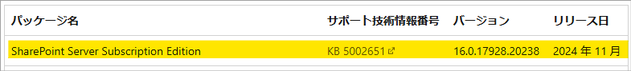

**_例 2 : "SharePoint Server 2019" を 2024 年 11 月時点の最新状態にする場合_**
言語に依存しない更新プログラムとして、2024 年 11月リリースの KB 5002650 を適用します。
言語に依存する MUI / 言語パッチは 2024 年 11 月にリリースされていないため、最新の 2024 年 8 月リリースの KB 5002597 を適用します。
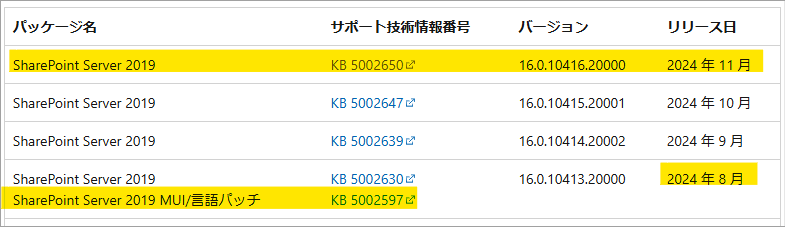

**_例 3 : "SharePoint Server 2016" を 2024 年 11 月時点の最新状態にする場合_**
言語に依存しない更新プログラムとして、2024 年 11月リリースの KB 5002654 を適用します。
言語に依存する MUI / 言語パッチは 2024 年 11 月にリリースされていないため、最新の 2023 年 12 月リリースの KB 5002524 を適用します。
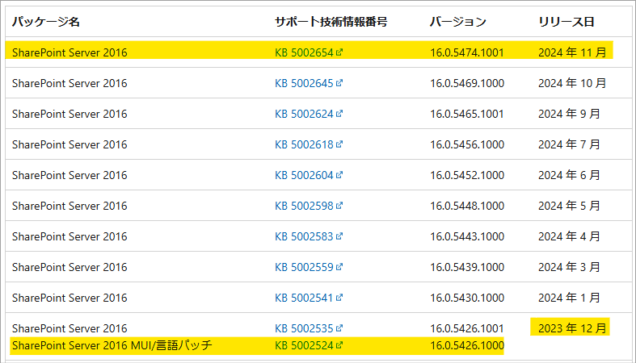

## SharePoint Server 製品の更新プログラム適用手順 
下記は、オンプレミスの SharePoint Server 製品における一般的な適用手順です。

更新プログラム適用時のベスト プラクティスについては、弊社エンジニアの下記 Blog 記事をご参照ください。
>参照 : [SharePoint Patching Best Practices – Stefan Goßner](https://blog.stefan-gossner.com/2020/02/11/sharepoint-patching-best-practices/)

更新プログラムの適用にあたり、以下の注意事項をご確認ください。
- 更新プログラムは個別にアンインストールできません。

- 更新プログラムを適用する前に、システムおよび SharePoint の完全なバックアップを実施することを強く推奨いたします。特に、カスタマイズや設定変更を実施されている場合は、更新プログラムの適用により現在の設定が既定の設定に置き換わる場合がありますので、カスタマイズや設定変更に関するバックアップも取得してください。  例：\Program Files\Common Files\Microsoft Shared\web server extensions\ フォルダ下のファイルを直接変更している、SharePoint に関連するレジストリ、データベースの権限を変更している等

- SharePoint 製品とテクノロジに、独自に開発したカスタム Web パーツやワークフローなどのソリューションを組み込んでいる場合は、カスタマイズの内容が更新プログラムの適用に伴う動作変更や更新の影響を受ける可能性があります。検証環境において、事前の動作検証を実施することを推奨いたします。

### 1. 更新プログラムのダウンロード 
下記の公開情報から適用する更新プログラムを確認し、ダウンロードします。
>参照 : [SharePoint 更新プログラム - Office release notes | Microsoft Learn](https://learn.microsoft.com/ja-jp/officeupdates/sharepoint-updates) 

1. 上記公開情報から対象の更新プログラムをクリックし、説明ページを開きます。
例：
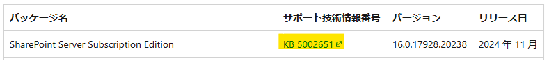

2. Microsoft ダウンロード センターのリンクをクリックします。
例：
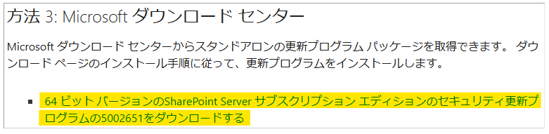 

3. スタンドアロン の更新プログラム パッケージをダウンロードします。
例：
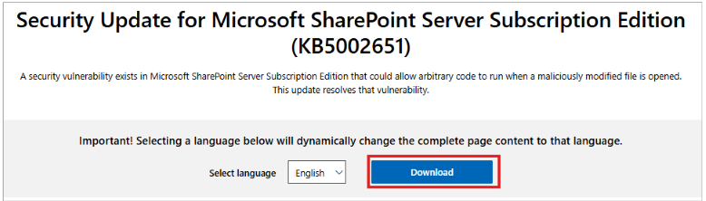

>**NOTE**
>- 更新プログラムのダウンロード ボタン横にある言語選択は、更新プログラムに関わるものではなく、当該ページの表示言語を設定するものです。
>- 更新プログラムのファイル (.exe、.cab ファイル等) は、更新プログラムの種類ごとに全て同じディレクトリに展開及び配置したうえで、適用をご実施ください。
>- 既にインストールされている更新プログラムは、SharePoint サーバーの全体管理の アップグレードと移行 > [製品および更新プログラムのインストール状態の確認] から確認できます。

### 2. 更新プログラムのインストール
1. すべての Web サーバー上でサービス 管理コンソール (services.msc) を起動し、World Wide Web 発行サービス (W3SVC) を停止してサーバー ファームからユーザーを切断します。
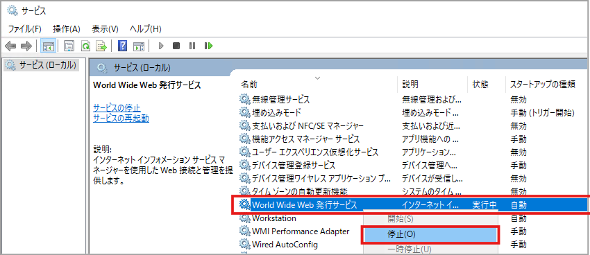

2. サーバー ファーム内のすべての SharePoint サーバーに、更新プログラムをインストールします。
   - 更新プログラムをインストールするサーバーの順番は任意です。
   - 言語に依存する更新プログラムと MUI / 言語パッチの両方をインストールする場合、インストールする順番は任意です。
   - インストール時に実行中のアプリケーションを閉じる必要があることを示すダイアログが表示された場合には、「セットアップの完了後、自動的にアプリケーションを閉じて再起動する」を選択して [OK] をクリックします。
   - 更新されるモジュールの実行状況によっては、サーバーの再起動を求められる場合があります。その場合は、サーバーを再起動してください。

>**NOTE**
>- **すべての SharePoint サーバーに更新プログラムの適用が完了するまでは、SharePoint Server 製品構成ウィザードを開始しないでください。**
>    - 更新プログラムのインストール後に SharePoint 製品構成ウィザードが起動した場合には [キャンセル] をクリックします。
>- SharePoint Server Subscription Edition の場合、更新プログラムのインストールに時間がかかる場合があります。
>    - 弊社エンジニアの下記 Blog 記事にて、インストール時間を短縮するスクリプトをご紹介しています。 参照 : [Solving the extended install time for SPSE CUs – Stefan Goßner](https://blog.stefan-gossner.com/2024/03/08/solving-the-extended-install-time-for-spse-cus/)

  
### 3. SharePoint 製品構成ウィザードの実行 
SharePoint 製品構成ウィザードの実行は、すべての SharePoint サーバーに更新プログラムをインストールした後に実施してください。SharePoint 製品構成ウィザードの実行は、以下の順番での実施を推奨します。
- SharePoint サーバーの全体管理 Web サイトをホストするアプリケーション サーバー
- 他のアプリケーション サーバー (アプリケーション、分散キャッシュ、検索、カスタム)
- フロントエンド サーバー

サーバーの役割は、SharePoint サーバーの全体管理の システム設定 > [このファームのサーバーの管理] から確認することができます。
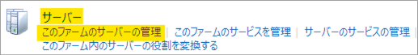

1. スタート メニューから SharePoint 製品構成ウィザード を起動します。
例：SharePoint Server Subscription Edition の場合
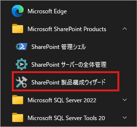

2. 製品構成ウィザードの [SharePoint 製品へようこそ] ページで [次へ] をクリックします。 
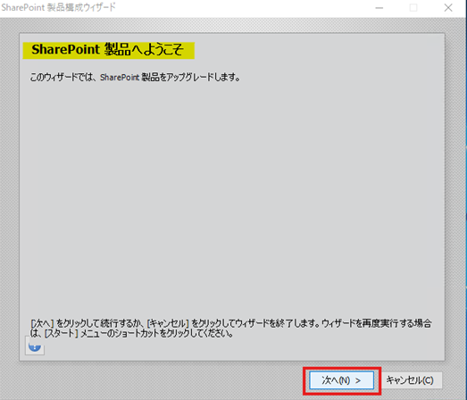 

3. 下図のような、一部のサービスの再起動が必要になる可能性があることを通知するダイアログ ボックスが表示されますので、 [はい] をクリックします。
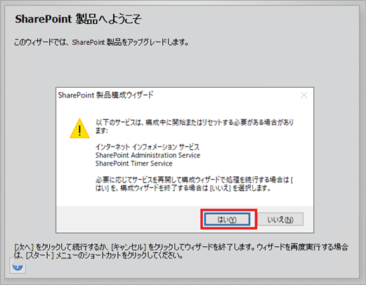

4. [SharePoint 製品構成ウィザードの終了] ページで [次へ] をクリックし、構成を実行します。
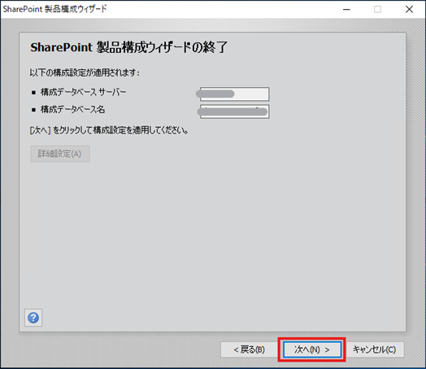  
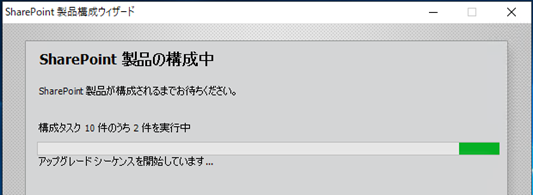

5. 構成が完了したら、[完了] をクリックして SharePoint 製品構成ウィザードを終了します。
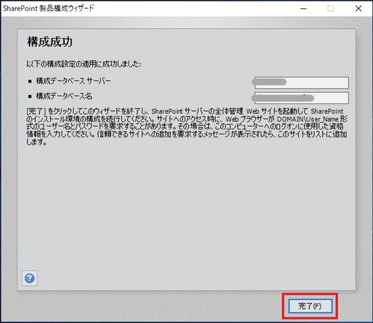 

6. サービス 管理コンソール (services.msc) を起動し、World Wide Web 発行サービスの状態を確認します。
   - 状態が 「停止中」 の場合は手動で開始し、ユーザーが Web サーバーを使用できるようにします。
   - 既に当該サービスが自動で開始されて状態が 「実行中」 の場合は、次の手順に進みます。

### 4. 適用の確認

1. SharePoint サーバーの全体管理から、アップグレードと移行 > [製品および更新プログラムのインストール状態の確認] を開きます。

2. 適用した 更新プログラムが表示されていることを確認します。更新プログラムが単一かどうかにかかわらず、下図のように、言語に依存しない更新プログラムと MUI / 言語パッチの２つが確認できます。(言語パッチは、インストールされている SharePoint の Language Pack の言語に合わせてインストールされます)  例：日本語パック (1041 Language Pack) がインストールされている場合
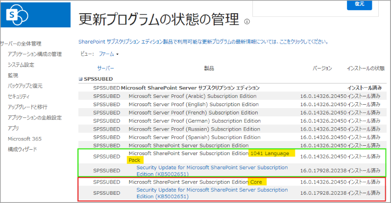

3. SharePoint サーバーの全体管理から、システム設定 > [このファームのサーバーの管理] を開きます。

8. インストールした更新プログラムのバージョンが、構成データベースのバージョンとなっていることを確認します。
例：SharePoint Server Subscription Edition の KB 5002651 の場合
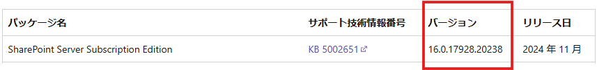
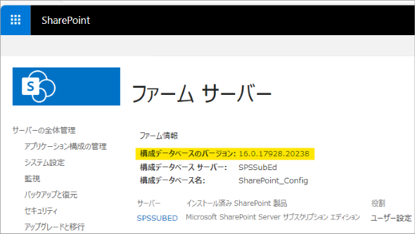

>**NOTE**
>SharePoint 2016 では、更新プログラムを適用しても構成データベースのバージョンが更新されない場合がありますが、本手順 1 と 2 にて更新プログラムがインストールされていることが確認できれば問題ありません。

 
今回の記事は以上となります。
ご不明点等がありましたら、弊社サポート サービスまでお気軽にお問い合わせください。