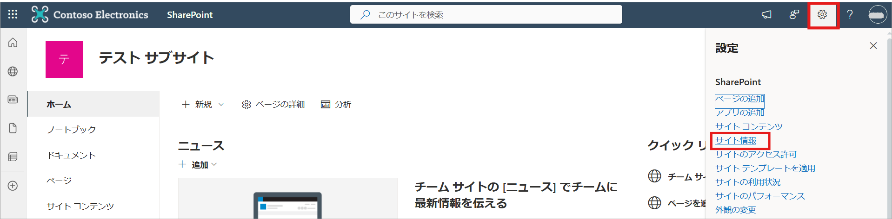
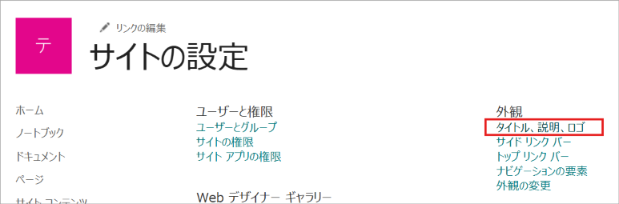
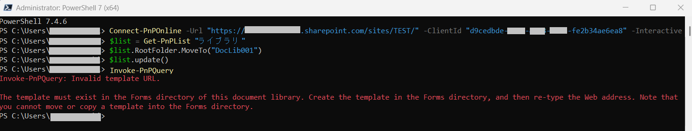

本記事では、SharePoint Online の サブサイトまたはライブラリの URL に日本語などのマルチバイト文字が含まれていることで、サイトへの接続がエラーとなる事象と対処方法を説明します。

## 事象について
サブサイトやライブラリの URL に日本語などのマルチバイト文字が含まれている場合に、対象のサブサイトやライブラリにアクセスできなくなる事象が過去に確認されています。

本事象が発生した場合、「このページは表示できません」(Edge ブラウザーの場合) のエラーメッセージがブラウザーに表示されます。ただし、このエラーはネットワーク観点の問題が発生している可能性があることを示す内容であるため、エラーの内容からただちに本問題に該当しているか判断することはできません。
切り分けとして、他の SharePoint サイトにアクセスした場合の動作についても調査を行い、特定の SharePoint サイトやライブラリのみで接続できない状態なのかを確認することで、本問題に該当しているかを判断する必要があります。

なお、本事象は確率的に発生し、発生した場合でもネットワーク環境を切り替えることや時間経過により自然に解消することもあり、現時点では具体的な要因は特定されていません。

サブサイトやライブラリの URL にマルチバイト文字を含めてしまった場合は、後述する方法で半角英数字のみの別の URL に変更を実施してください。

## 対処方法
以下の方法にて、サブサイトまたはライブラリの URL を変更することができます。

### サブサイトの URL を変更する場合
サブサイトの URL は GUI から変更します。

1. サブサイトを開き、画面右上の設定アイコンから [サイト情報] を選択します。
 

2. [すべてのサイト設定を表示] を選択します。

3. 外観 カテゴリの [タイトル、説明、ロゴ] を選択します。

4. URL 名を半角英数字に変更し、[OK] を選択します。


### ライブラリの URL を変更する場合
ライブラリの URL は PnP PowerShell で変更します。

【事前準備】
 - PnP PowerShell の使用には PowerShell 7.4.4 以降が必要です。インストールについては下記公開情報を参照してください。
参照：[Windows への PowerShell 7.4 のインストール](https://learn.microsoft.com/ja-jp/powershell/scripting/install/installing-powershell-on-windows?view=powershell-7.4)
- PnP PowerShell を初めて利用する場合は、下記の公開情報を参照してモジュールのインストールやアプリケーションの登録などを実施してください。
参照：[PnP PowerShell の概要 | Microsoft Learn](https://learn.microsoft.com/ja-jp/powershell/sharepoint/sharepoint-pnp/sharepoint-pnp-cmdlets)

1. PowerShell 7 を管理者として実行します。

2. 以下を 1 行ずつ実行します。


```powershell
Connect-PnPOnline -Url "<サイト URL>" -ClientId "<PnP PowerShell 用に登録したアプリケーションの Client ID>" -Interactive
$list = Get-PnPList "<現在のライブラリ名>"
$list.RootFolder.MoveTo("<半角英数字のみで構成する変更後のライブラリ パス (例 :DocLib001)>")
$list.Update()
Invoke-PnPQuery
```

**NOTE**
- 1行目のコマンド実行後の PnP PowerShell へのログインは、サイト管理者の権限をもつユーザーで実施してください。
- " Invoke-PnPQuery: テンプレートの URL が正しくありません。/ Invoke-PnPQuery: Invalid template URL." というメッセージが表示されますが、異常ではありません。

例：


3. 上記コマンドを実行後、数分経過後に変更後の URL にアクセスし、事象が解消されページが閲覧できることを確認してください。新しい URL でも引き続き問題が生じる場合は、一度ブラウザーのキャッシュをクリアしてからご確認ください。

<br>
今回の記事は以上となります。 ご不明点等がありましたら、弊社サポート サービスまでお気軽にお問い合わせください。
